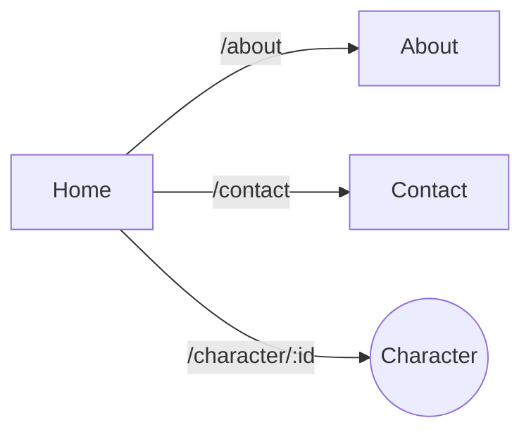

[](https://github.com/Eliott7179/marvel-app)

[](https://sonarcloud.io/summary/new_code?id=Eliott7179_html-to-app)

[](https://sonarcloud.io/summary/new_code?id=Eliott7179_html-to-app)

# Marvel App

## Installation
Récupérer le projet en local et installer les dépendances
```mermaid
git clone url-du-projet
cd marvel-app
npm install
```
## Lancement

```mermaid
npm start
```

L'application est accessible à l'adresse http://localhost:3000

## Test

Execution des tests unitaires en mode watch, c'est à dire que les tests sont relancés chaque modification de code.

```mermaid
npm test
```

Execution des tests uniquement une fois avec un rapport détaillé de la couverture du code

```mermaid
npm run test:coverage
```

## Conception

Le projet est composé de 4 pages :
- Home (page d'accueil): Liste des personnages 
- Character: Page de détail d'un personnage
- About: Page d'information sur l'application
- Contact: Page de contact


